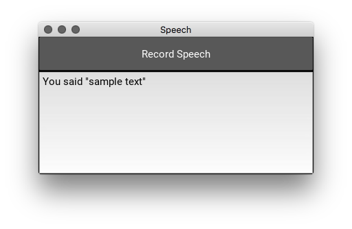

Python Speech Recognition GUI Demo
================================================================================
This program is a brief demonstration of the usage of Python in conjunction with a GUI Framework (Kivy) to create an application that allows the user to input text and recognize it using the Google Speech API.

Screenshot
--------------------------------------------------------------------------------

Quickstart
--------------------------------------------------------------------------------
The main entry into the program is 'main.py' simply execute `python main.py` with the appropriate dependencies installed. Upon execution of the program, the first thing it will do is calibrate the microphone's ambient volume. It is important to stay quiet during this time so that the microphone may establish an accurate baseline.

Following the microphone's calibration, whenever ready, simply press the button labeled 'Record Speech'. This will initiate a blocking listening operation which will capture microphone input, send it to Google's servers, which will then attempt to parse it. Following successful parsing or failure, the output will be printed in the corresponding text field below the button.

Requirements
--------------------------------------------------------------------------------
- Kivy (https://github.com/kivy/kivy)
- SpeechRecognition (https://github.com/Uberi/speech_recognition)
- Pyinstaller (for distribution) (https://github.com/pyinstaller/pyinstaller)
  
Building for Distribution
--------------------------------------------------------------------------------
- Manually create or generate a pyinstaller specification file
- Execute `pyinstaller main.py`
- Your binary will be available in the distribution folder

License
--------------------------------------------------------------------------------
- This program is licensed under the BSD License, please see the 'LICENSE.txt' file for more information.
